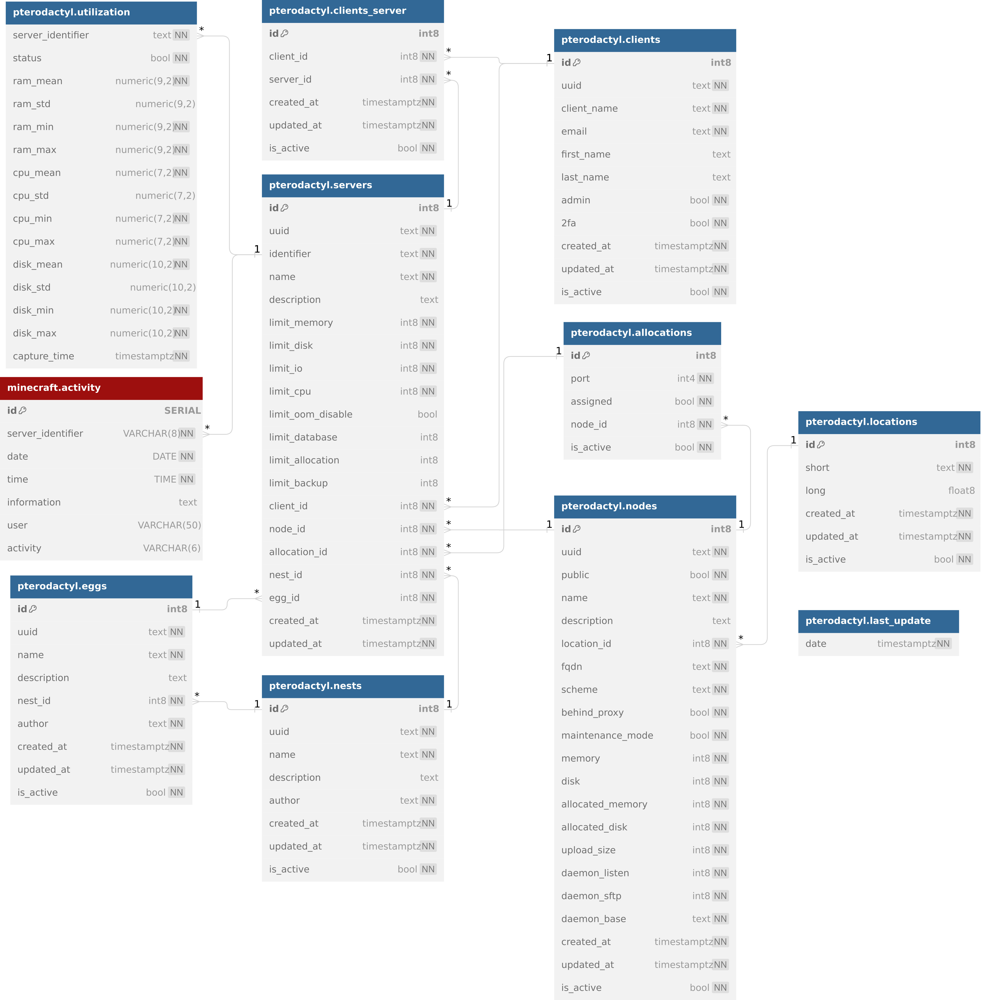

# Data Warehouse with PostgreSQL

We chose to use PostgreSQL because it is self-hosted and free. While it is typically designed as a database, we find it useful to leverage it as a data warehouse in this specific context

## Schemas

[Brief description]

### pterodactyl

[Create a table and specify the tables in it and what are they for]
[Specify which pipelines are involved in this schema as a side note]

### pterodactyl_update

[Create a table and specify the tables in it and what are they for]
[Specify which pipelines are involved in this schema as a side note]

### minecraft

[Create a table and specify the tables in it and what are they for]
[Specify which pipelines are involved in this schema as a side note]

## Data Modeling (pterodactyl)

For the `pterodactyl` schema, we adopted a structure resembling a star schema, with the `servers` table at the center. However, it's important to note that the `servers` table is not our fact table. The measurable data resides in the `utilization` table and the `activity` table across different schemas, such as the `activity` table in the `minecraft` schema.

This schema design is based on the data retrieved from the `Pterodactyl API` and serves as the foundation for our analyses, featuring numerous dimension tables.

Below, you can easily explore the relationships between the data. For more in-depth information, we recommend reviewing the various `.sql` files available here, as they all include comments on each table and attribute

